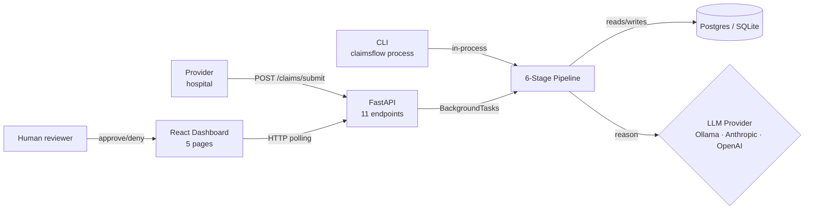
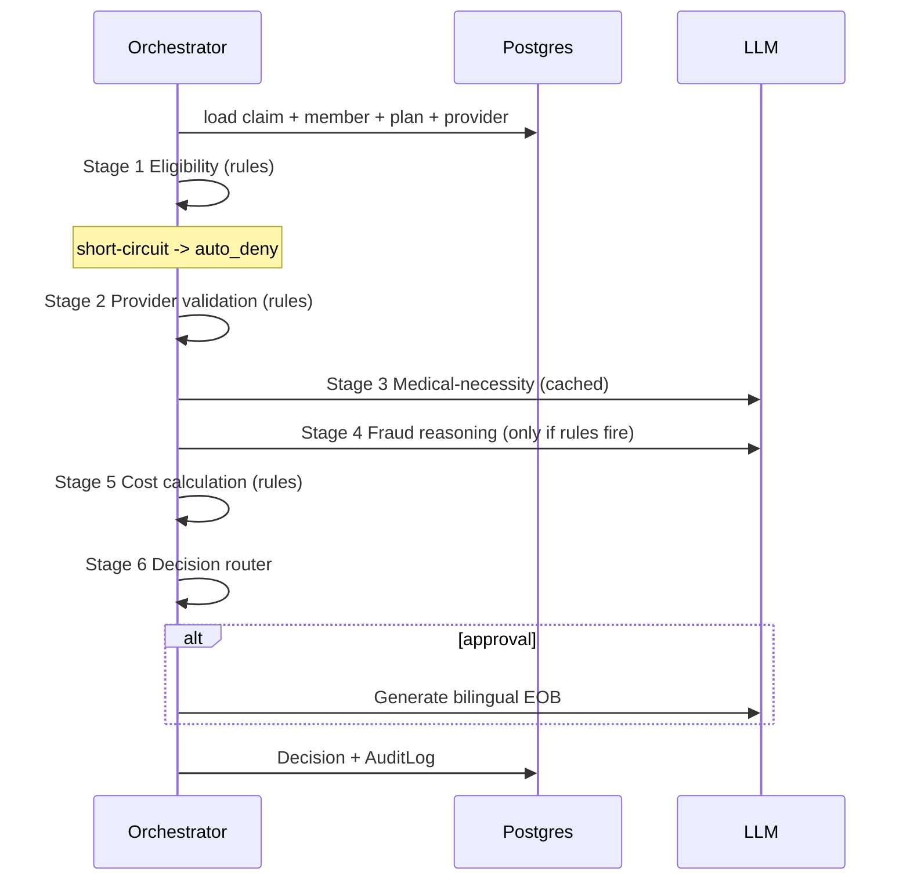

# ClaimsFlow

> Auto-adjudicates medical claims in seconds with a 6-stage AI pipeline. Open-source, BYOK, runs locally with free Ollama or your own Anthropic / OpenAI key.

<p>
  
  
  
  
  
  
  
</p>

> [!NOTE]
> **Portfolio PoC.** Synthetic data only. Not affiliated with any real insurer. Built as a demonstration of workflow automation + agentic AI + healthcare-insurance domain modeling. See [What's not production-ready](#whats-not-production-ready).

---

## What is this?

A hospital submits a medical claim. ClaimsFlow runs it through six sequential stages — eligibility, provider validation, medical-necessity reasoning, fraud detection, cost calculation, and decision routing — then auto-approves it, sends it to a human reviewer with a written reasoning paragraph, or holds it for fraud investigation. End-to-end in a few seconds. For approvals it also generates a bilingual (English + Arabic) Explanation of Benefits letter to the member.

| Question | Answer |
| --- | --- |
| What does it do? | Auto-adjudicates medical insurance claims with an LLM in the loop on 2 of 6 stages |
| Who is it for? | Insurance operations teams, automation engineers, healthcare PMs |
| What's the demo? | Drop a claim JSON in via CLI or webhook → watch the dashboard decide it live |
| What's the stack? | Python · FastAPI · SQLAlchemy · Postgres / SQLite · React · Tailwind · Ollama (default) / Anthropic / OpenAI |
| How do I run it? | `pip install -e backend && claimsflow init && claimsflow seed && claimsflow demo`, plus `npm install && npm run dev` for the dashboard |

---

## Features

- 🧠 **6-stage pipeline** — eligibility, provider validation, medical-necessity (LLM), fraud detection (rules + LLM), cost calculation, decision routing
- 🌍 **Bilingual EOBs** — auto-generates member letters in Arabic and English with proper RTL layout
- 🔌 **3 LLM providers** — Anthropic Claude, OpenAI, or free local Ollama via BYOK; settings-driven swap
- ⚡ **Real-time + batch** — webhook for n8n (deferred), CLI for batch backfills, FastAPI for direct integration
- 🎯 **Confidence-aware routing** — exception queue prioritised by AI uncertainty, SLA age, and amount
- 🕵️ **Fraud signals** — velocity / duplicate / amount-anomaly / demographic-mismatch rules plus LLM reasoning
- 📊 **Operations dashboard** — 5 pages, live updates every 10s, keyboard shortcuts on the queue, side panel with full AI reasoning
- 🧾 **Complete audit trail** — one log row per pipeline stage, every human override is logged with reviewer ID
- 🔁 **Settings-driven config** — pydantic-settings reads `.env`; no hard-coded environment

---

## Architecture

### System (current state — interview-ready scope)



### Pipeline sequence



### How a claim moves through the system

| Stage | Input | What it checks | LLM? | Output |
| --- | --- | --- | --- | --- |
| 1. Eligibility | Member status, dates, plan | Policy active? Service date in window? Annual limit? Benefit covered? Diagnosis excluded? | — | `eligible`, `reasons`, `remaining_limit` |
| 2. Provider validation | Provider, line items | License valid? Rate within 120% of contracted? In-network? | — | `valid`, `network_tier`, `rate_variance`, flags |
| 3. Medical necessity | Diagnoses, procedures | Does the procedure set fit the diagnosis set? | ✓ (cached) | `is_appropriate`, `confidence`, `reasoning` |
| 4. Fraud detection | Claim + recent history | Duplicate? Velocity? Amount anomaly? Demographic mismatch? | ✓ (only if rules fire) | `fraud_risk_score`, `signals`, `reasoning` |
| 5. Cost calculation | All prior + contracted rates | Contracted total, deductible, copay, annual-limit cap | — | `covered`, `payable_to_provider`, `member_responsibility` |
| 6. Decision router | All prior results | Amount ceiling, soft flags, fraud score | — | `auto_approve` / `auto_approve_with_audit` / `human_review` / `fraud_hold` / `auto_deny` |

Full architecture deep-dive lives in [`docs/ARCHITECTURE.md`](./docs/ARCHITECTURE.md) — includes the C4 system context, ER diagram, prompt templates, failure modes, and per-stage data shapes.

---

## Quick start

### 🐍 Local Python (zero Docker)

```bash
cd backend
python -m venv .venv
.\.venv\Scripts\Activate.ps1     # macOS/Linux: source .venv/bin/activate
pip install -e ".[dev]"

cp ..\.env.example ..\.env       # edit if you want — defaults to Ollama local

claimsflow init                  # creates SQLite tables
claimsflow seed --small          # 5 plans, 20 providers, 50 members, 100 claims
claimsflow demo --count 30       # adjudicates 30 claims, prints histogram
claimsflow serve                 # FastAPI at http://localhost:8000 (OpenAPI at /docs)
```

```bash
# In another terminal — the dashboard
cd frontend
npm install
npm run dev                      # http://localhost:5173
```

You should see the **Overview** page light up with metrics. The **Exceptions** tab shows claims routed to human review; click any row (or press `Enter`) to open the side panel with the AI reasoning paragraph and policy citations.

### 🔑 Bring your own key (optional)

The default is local Ollama (free). To use a real API:

<details>
<summary>Anthropic Claude</summary>

```env
LLM_PROVIDER=anthropic
ANTHROPIC_API_KEY=sk-ant-...
ANTHROPIC_MODEL=claude-haiku-4-5-20251001
```

Recommended model is Haiku for cost. The pipeline uses tool-use for structured output, which works across Claude families.
</details>

<details>
<summary>OpenAI</summary>

```env
LLM_PROVIDER=openai
OPENAI_API_KEY=sk-...
OPENAI_MODEL=gpt-4o-mini
```

Uses `response_format=json_schema` for structured output.
</details>

<details>
<summary>Ollama (default, free)</summary>

```env
LLM_PROVIDER=ollama
OLLAMA_BASE_URL=http://localhost:11434
OLLAMA_MODEL=llama3.1:8b
```

Install Ollama from [ollama.com](https://ollama.com), then `ollama pull llama3.1:8b`. The pipeline uses Ollama's `format: json` mode plus schema embedded in the system prompt.
</details>

---

## Demo

See [`docs/DEMO_SCRIPT.md`](./docs/DEMO_SCRIPT.md) for a 5-minute scene-by-scene walkthrough — exactly what to type and what to point at on screen.

> [!TIP]
> The seed data includes ~5% fraud-pattern claims (velocity, duplicates, procedure-diagnosis mismatch). Run `claimsflow demo` then open `/queue/fraud` to see them flagged with LLM reasoning.

---

## Project structure

```text
.
├── backend/
│   ├── claimsflow/
│   │   ├── core/           # settings (pydantic-settings), structlog, SQLAlchemy session
│   │   ├── models/         # ORM (orm.py) + Pydantic schemas (schemas.py) + shared enums
│   │   ├── pipeline/       # 6-stage adjudication + orchestrator + EOB + verdict cache
│   │   ├── providers/      # LLMProvider Protocol + Anthropic / OpenAI / Ollama + router
│   │   ├── api/            # FastAPI app + 6 route modules + middleware + deps
│   │   ├── cli/            # Click + Rich CLI (init/seed/process/status/serve/demo/stats)
│   │   └── seed/           # Saudi-realistic synthetic data generators
│   ├── tests/              # pytest — 76 tests, 90% coverage
│   ├── alembic/            # initial migration generated from metadata
│   └── pyproject.toml
├── frontend/
│   ├── src/
│   │   ├── lib/            # typed API client, TanStack hooks, types, formatters
│   │   ├── components/     # Badge, ConfidenceMeter, ExceptionSidePanel, EobModal, …
│   │   └── pages/          # Overview, ExceptionQueue, FraudQueue, ClaimDetail, Quality, Insights
│   ├── tailwind.config.ts  # deliberate non-default palette + Manrope/JetBrains Mono
│   └── vite.config.ts
├── docs/
│   ├── ARCHITECTURE.md     # C4, ER, sequence diagrams, prompts, failure modes
│   ├── DEMO_SCRIPT.md      # 5-minute interview script
│   └── BENCHMARKS.md       # planned measurement suite
├── n8n/                    # importable workflow JSON (Module 9 — deferred)
├── docker/                 # Dockerfiles (Module 8 — deferred)
└── .github/workflows/ci.yml   # lint + test on push/PR for backend + frontend
```

---

## Tech decisions

| Decision | Why | Alternative considered | Trade-off |
| --- | --- | --- | --- |
| FastAPI over Flask | Native async, automatic OpenAPI, Pydantic v2 | Flask + flask-restx | Smaller plugin ecosystem |
| SQLAlchemy 2.x typed `Mapped[…]` | mypy-friendly, modern, future-proof | SQLAlchemy 1.x classic | Steeper learning curve |
| LLM only on stages 3 + 4 | Cost ($) and latency (ms) — stages 1, 2, 5, 6 are pure rules | LLM on every stage | Less flexibility on rule-based stages |
| Tool-use for structured Anthropic output | More reliable than asking for JSON in the prompt | Prompt-engineered JSON | Anthropic-specific code |
| Cache medical-necessity by (dx, cpt) hash | Most outpatient claims repeat the same code combinations | No cache | Process-local; needs Redis swap for multi-process |
| In-process BackgroundTasks (FastAPI) | Simpler than Celery for a PoC | Celery + Redis | Doesn't survive process restart |
| Hand-written TS types instead of OpenAPI-generated | Avoids an extra build step | `openapi-typescript` | Drift risk; update in tandem |
| Tailwind with hand-picked tokens, no shadcn defaults | Looks like an enterprise product, not a generic AI app | shadcn default palette | Less plug-and-play |

---

## What's NOT production-ready

This is a portfolio PoC. The following gaps are **deliberate**:

- **Synthetic data only** — no real PHI / PII handling, no encryption at rest, no field-level redaction
- **No SAMA / CCHI compliance** — neither certified nor audited
- **ICD-10 / CPT** codes use public lists; the descriptions are paraphrased (proper data is licensed)
- **No HA / multi-region** — single-process, single-DB
- **No authn/z model** — single static `X-API-Key` + HMAC for the n8n webhook only; no per-user permissions
- **Cache is process-local** — Redis swap needed for multi-process deployments
- **Background tasks don't survive restart** — a real queue (Celery / RQ / SQS) is needed for at-least-once
- **No rate-limit-aware LLM batching** — bulk processing of >100 claims could hit provider limits
- **Not affiliated with any real insurer** — built as a learning project framed around the domain

This list is the kind of thing worth surfacing to evaluators before they ask. It signals you know what real production looks like.

---

## Roadmap (what I'd build next)

1. **Module 8 — Docker compose** — `docker compose up` brings up Postgres + API + dashboard with healthchecks
2. **Module 9 — n8n workflow JSON** — importable workflow demonstrating the webhook integration (Slack → Jira on fraud holds)
3. **Redis-backed verdict cache** for multi-process deployments
4. **Per-user RBAC** so reviewers see only the claims they own
5. **A real test against ICD-10 / CPT licensed datasets**
6. **Audit-grade signed log chain** (hash-linked AuditLog rows)

---

## Built with

[Python](https://www.python.org/) · [FastAPI](https://fastapi.tiangolo.com/) · [SQLAlchemy](https://www.sqlalchemy.org/) · [Pydantic](https://docs.pydantic.dev/) · [Click](https://click.palletsprojects.com/) · [Rich](https://rich.readthedocs.io/) · [structlog](https://www.structlog.org/) · [Anthropic SDK](https://github.com/anthropics/anthropic-sdk-python) · [OpenAI SDK](https://github.com/openai/openai-python) · [Ollama](https://ollama.com/) · [React](https://react.dev/) · [Vite](https://vitejs.dev/) · [TypeScript](https://www.typescriptlang.org/) · [Tailwind](https://tailwindcss.com/) · [TanStack Query](https://tanstack.com/query) · [Recharts](https://recharts.org/) · [pytest](https://docs.pytest.org/) · [Vitest](https://vitest.dev/)

---

## License + acknowledgements

MIT — see [LICENSE](./LICENSE). Thanks to the maintainers of all the libraries above. 