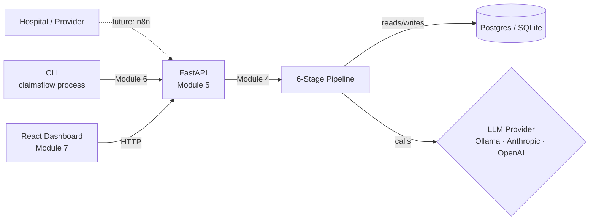
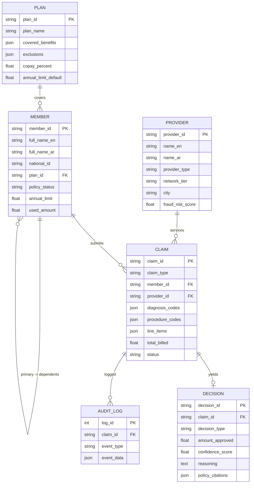
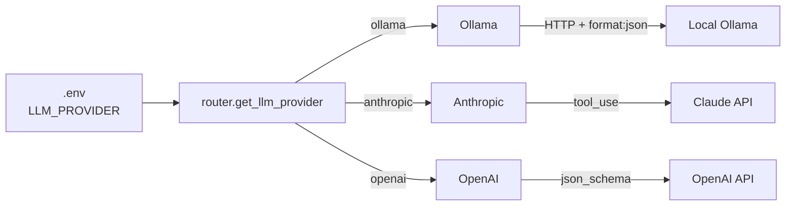
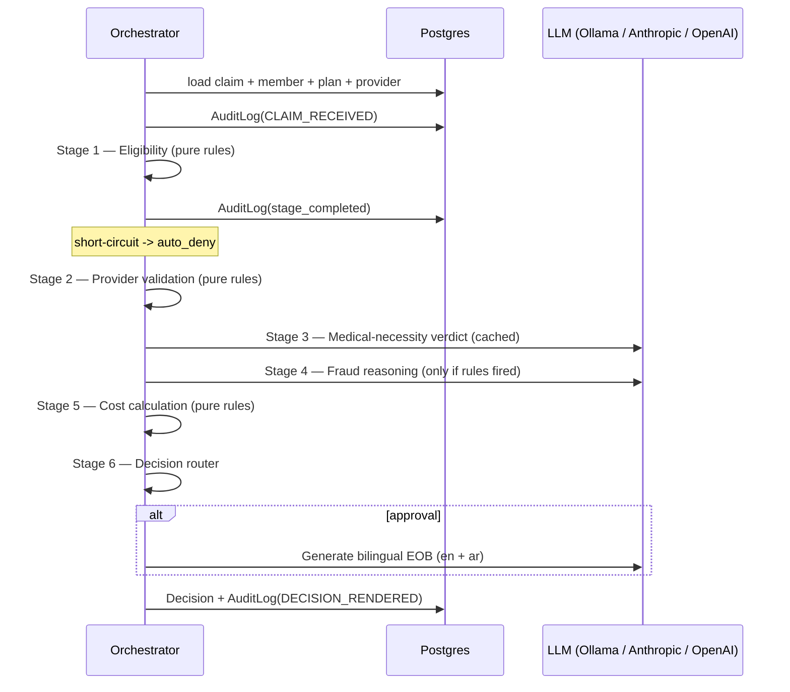

# Architecture

> Detailed technical documentation. Updated after each module ships.

## Current state — Module 1 (scaffold)

Nothing in the diagram above is implemented yet — only the package skeleton, configuration, and CI exist after Module 1. Subsequent modules fill in each box.

## Module 1 — what shipped

- Python package `claimsflow` with subpackages for each layer (core / models / pipeline / providers / api / cli / seed)
- Typed settings (`pydantic-settings`) with `.env` loading
- Structured logging via `structlog` — JSON in production, color in dev
- SQLAlchemy 2.x engine + session factory keyed on `DATABASE_URL`
- Alembic environment wired to the same settings + metadata
- React 18 + Vite + TypeScript + Tailwind frontend with custom design tokens (Manrope / JetBrains Mono, deliberate non-default palette)
- Pre-commit (ruff + black + frontend eslint)
- GitHub Actions CI: backend lint + test, frontend lint + test + build
- MIT license + comprehensive `.gitignore`

## Decisions locked in Module 1

| Decision | Why | Alternative | Trade-off |
| --- | --- | --- | --- |
| Pydantic-settings over raw `os.environ` | Type-safe, validated, cached, IDE-friendly | `python-dotenv` + manual reads | Slight extra dep |
| SQLAlchemy 2.x typed `DeclarativeBase` | Modern API, mypy-friendly, future-proof | SQLAlchemy 1.x classic API | Steeper migration if upstream changes |
| `lru_cache`-backed singletons (`get_settings`, `get_engine`) | Cheap, thread-safe, test-overridable via `cache_clear()` | Module-level globals | Slight indirection |
| Manrope + JetBrains Mono pairing | Geometric humanist + technical mono — not generic Inter | Inter / Plex | Loads from Google Fonts |
| Tailwind config with custom `decision.*` color tokens | Constrains the dashboard to a deliberate palette | shadcn defaults | Less plug-and-play |

## Module 2 — what shipped

- 6 ORM entities (`Plan`, `Member`, `Provider`, `Claim`, `Decision`, `AuditLog`) with proper relationships including self-referential `Member.dependents`
- Pydantic v2 schemas mirroring the ORM, plus `ClaimSubmission` for the API ingest shape (validates non-empty diagnosis/procedure/line-item lists)
- StrEnum-backed enums shared across ORM, Pydantic, and pipeline layers
- Alembic initial migration generated from the metadata; verified end-to-end against fresh SQLite
- Synthetic-data generators producing Saudi-realistic data: Arabic + English names from curated pools, ICD-10 codes covering common Saudi diagnoses (diabetes, hypertension, asthma, plus pediatric subset), CPT codes with realistic SAR pricing
- Deterministic generation (seeded `random.Random`) so the same seed always produces the same dataset — required for reproducible tests and benchmarks
- Intentional data variety: ~5% fraud-pattern claims (velocity, duplicates, procedure-diagnosis mismatch), ~15% exception cases (out-of-network, soft flags), ~80% routine
- `claimsflow init [--reset]` and `claimsflow seed [--small|--full]` CLI commands with Rich progress + summary tables

### ER diagram (Module 2)

## Module 3 — what shipped

- `LLMProvider` Protocol with a single `reason(system, user, schema) -> LLMResponse[T]` method
- Three implementations sharing one contract: `AnthropicProvider` (tool-use coercion for structured output), `OpenAIProvider` (json_schema response format), `OllamaProvider` (HTTP + `format: json` mode with schema embedded in system prompt)
- Robust `parse_structured_response()` helper that strips markdown fences and extracts JSON from surrounding prose — small models need this
- Settings-driven `get_llm_provider()` router cached via `lru_cache`; `reset_provider_cache()` for tests
- Exponential backoff via `tenacity` on all three providers (3 attempts, 1–8s wait)
- Token usage + per-call latency recorded on every response (`LLMResponse.usage`, `.latency_ms`)
- Mocked unit tests cover all three providers + router + parser; opt-in `@pytest.mark.integration` test hits the real Anthropic API when `ANTHROPIC_API_KEY` is present

### Provider selection

## Module 4 — what shipped (the agentic core)

Six sequential stages, plus a router and a bilingual EOB generator. Each stage is a class with an async `process(claim, ctx) -> StageResult`. The orchestrator runs them, persists a `Decision`, and writes one `AuditLog` per stage plus terminal events.

### Stage map

| Stage | Purpose | Pure rules | LLM | Caches |
| --- | --- | --- | --- | --- |
| Eligibility | Policy status, service-date window, annual limit, benefit coverage, plan-level diagnosis exclusions | ✓ | — | — |
| Provider validation | License validity, contracted-rate variance (>120% flagged), out-of-network flag | ✓ | — | — |
| Medical necessity | Does the procedure set fit the diagnoses? Fast-path on known textbook pairings; LLM only when something's off | partial | ✓ | (dx, cpt) hash |
| Fraud detection | Duplicates within 7d, provider velocity, amount anomaly vs provider history, pediatric-on-adult mismatch, then LLM reasoning if any rule fires | partial | ✓ | — |
| Cost calculation | Apply contracted rates, deductible, copay, OOP cap. Out-of-network → 0% covered | ✓ | — | — |
| Decision router | Combine results + amount ceiling → auto_approve / auto_approve_with_audit / human_review / fraud_hold / auto_deny | ✓ | — | — |

### LLM cache (medical necessity)

Keyed on `sha256(sorted_diagnoses + "::" + sorted_procedures)[:16]`. In-process `OrderedDict` LRU, evicted at 2048 entries. The cache singleton lives at `claimsflow.pipeline.verdict_cache`; tests call `verdict_cache.clear()` between cases. The BENCHMARKS doc will quantify hit rate once Module 5/6 expose it.

### Reasoning + bilingual EOB

The orchestrator builds a one-paragraph reasoning string concatenating stage-by-stage findings (router verdict, eligibility outcome, provider tier/variance, LLM rationale, fraud signals). For auto-approved claims the EOB stage produces a bilingual member-facing letter (English + Arabic, schema-validated to require both languages non-empty). Falls back to a deterministic template if the LLM is unreachable.

### Tests

55 passing — every stage in isolation (with a `FakeProvider` standing in for the LLM), every decision path (approve / approve-with-audit / deny / human review / fraud hold), cache-hit verification, and full orchestrator end-to-end producing a persisted `Decision` plus audit trail.

## Module 5 — what shipped

FastAPI service exposing 11 endpoints across 6 routers, mounted under `/api/v1`. Pipeline processing runs in `BackgroundTasks` so submission is non-blocking. OpenAPI lives at `/docs`.

### Endpoints

| Method | Path | Purpose | Auth |
| --- | --- | --- | --- |
| GET | `/healthz`, `/healthz/db` | Liveness + DB probe | public |
| POST | `/api/v1/claims/submit` | Accept a claim, kick off pipeline | X-API-Key |
| GET | `/api/v1/claims/{id}` | Single claim + decision | public |
| GET | `/api/v1/claims` | Filtered, paginated list | public |
| POST | `/api/v1/claims/{id}/review` | Human override (logs `HUMAN_OVERRIDE` event) | X-API-Key |
| GET | `/api/v1/queue/exceptions` | Review queue, priority-sorted | public |
| GET | `/api/v1/queue/fraud` | Fraud-hold queue | public |
| GET | `/api/v1/metrics/overview` | Hero metrics | public |
| GET | `/api/v1/metrics/decisions` | Decision-type breakdown | public |
| GET | `/api/v1/metrics/quality` | Override rate + confidence stats | public |
| GET | `/api/v1/providers/top` | Top providers by volume or risk | public |
| POST | `/api/v1/webhook/n8n` | n8n entry point with HMAC-SHA256 signature | HMAC |

### Cross-cutting

- **CORS** — origins from `CORS_ORIGINS` (comma-separated). Exposes `X-Request-ID`.
- **Request ID** — middleware stamps every request with a 16-char UUID hex; binds it into structlog contextvars and echoes it back in the response.
- **Rate limiting** — `slowapi`, `120/minute` by default per remote IP. Returns 429.
- **Logging** — structlog JSON in production, colored key=value in dev. One `request.complete` line per request with method/path/status/latency.
- **Auth** — single static `X-API-Key` for writes; the n8n webhook uses HMAC-SHA256 over the raw body via `X-ClaimsFlow-Signature`. Public read endpoints make the demo trivially shareable.

### Tests

16 integration tests via `TestClient`: health + DB probe, request-id propagation, auth (401 without key, 202 with), single-claim get/404, list filtering by status, exception queue contents, metrics shape, decision breakdown, top-providers (volume + risk), webhook signature accept + reject. Uses `StaticPool` so the in-memory SQLite is shared across the test session and the background-task worker.

## Module 6 — what shipped

Click + Rich CLI exposing the full local workflow. Installed as the `claimsflow` console script.

| Command | Purpose |
| --- | --- |
| `claimsflow init [--reset]` | Create / recreate all DB tables |
| `claimsflow seed [--small\|--full] [--seed N]` | Populate synthetic data deterministically |
| `claimsflow stats` | Row counts per table (Rich table) |
| `claimsflow process <file\|dir>` | Adjudicate a claim JSON or a folder of them, with a Rich progress bar |
| `claimsflow status <claim_id>` | Pretty panel with claim summary, decision reasoning, flags, and the last 10 audit-log events |
| `claimsflow serve [--host --port --reload]` | Start the FastAPI app via uvicorn |
| `claimsflow demo [--count N]` | Scripted demo: picks N RECEIVED seeded claims, runs them through the pipeline, prints a decision-type histogram |
| `claimsflow hello` | Scaffold smoke test (Module 1 legacy) |

Tests (5): each command's happy path against a tmp-path SQLite, plus `status` for an unknown claim and `status` after a real `process` round-trip (verifies the audit trail prints).

## Pending modules

- **Module 7 — React dashboard** (the biggest remaining module)
- **Module 4 — 6-stage pipeline**
- **Module 5 — FastAPI service**
- **Module 6 — Click CLI**
- **Module 7 — React dashboard**
- **Module 10 — Full documentation**

Modules 8 (Docker) and 9 (n8n) are deferred — the interview-ready scope prioritizes the dashboard and pipeline.
