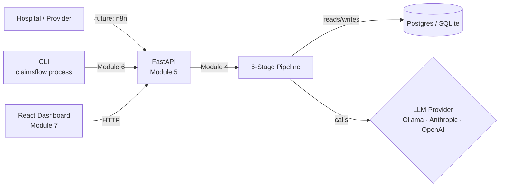

# Architecture

> Detailed technical documentation. Updated after each module ships.

## Current state — Module 1 (scaffold)

Nothing in the diagram above is implemented yet — only the package skeleton, configuration, and CI exist after Module 1. Subsequent modules fill in each box.

## Module 1 — what shipped

- Python package `claimsflow` with subpackages for each layer (core / models / pipeline / providers / api / cli / seed)
- Typed settings (`pydantic-settings`) with `.env` loading
- Structured logging via `structlog` — JSON in production, color in dev
- SQLAlchemy 2.x engine + session factory keyed on `DATABASE_URL`
- Alembic environment wired to the same settings + metadata
- React 18 + Vite + TypeScript + Tailwind frontend with custom design tokens (Manrope / JetBrains Mono, deliberate non-default palette)
- Pre-commit (ruff + black + frontend eslint)
- GitHub Actions CI: backend lint + test, frontend lint + test + build
- MIT license + comprehensive `.gitignore`

## Decisions locked in Module 1

| Decision | Why | Alternative | Trade-off |
| --- | --- | --- | --- |
| Pydantic-settings over raw `os.environ` | Type-safe, validated, cached, IDE-friendly | `python-dotenv` + manual reads | Slight extra dep |
| SQLAlchemy 2.x typed `DeclarativeBase` | Modern API, mypy-friendly, future-proof | SQLAlchemy 1.x classic API | Steeper migration if upstream changes |
| `lru_cache`-backed singletons (`get_settings`, `get_engine`) | Cheap, thread-safe, test-overridable via `cache_clear()` | Module-level globals | Slight indirection |
| Manrope + JetBrains Mono pairing | Geometric humanist + technical mono — not generic Inter | Inter / Plex | Loads from Google Fonts |
| Tailwind config with custom `decision.*` color tokens | Constrains the dashboard to a deliberate palette | shadcn defaults | Less plug-and-play |

## Pending modules

- **Module 2 — Domain models + seed data** (next)
- **Module 3 — LLM provider abstraction**
- **Module 4 — 6-stage pipeline**
- **Module 5 — FastAPI service**
- **Module 6 — Click CLI**
- **Module 7 — React dashboard**
- **Module 10 — Full documentation**

Modules 8 (Docker) and 9 (n8n) are deferred — the interview-ready scope prioritizes the dashboard and pipeline.
